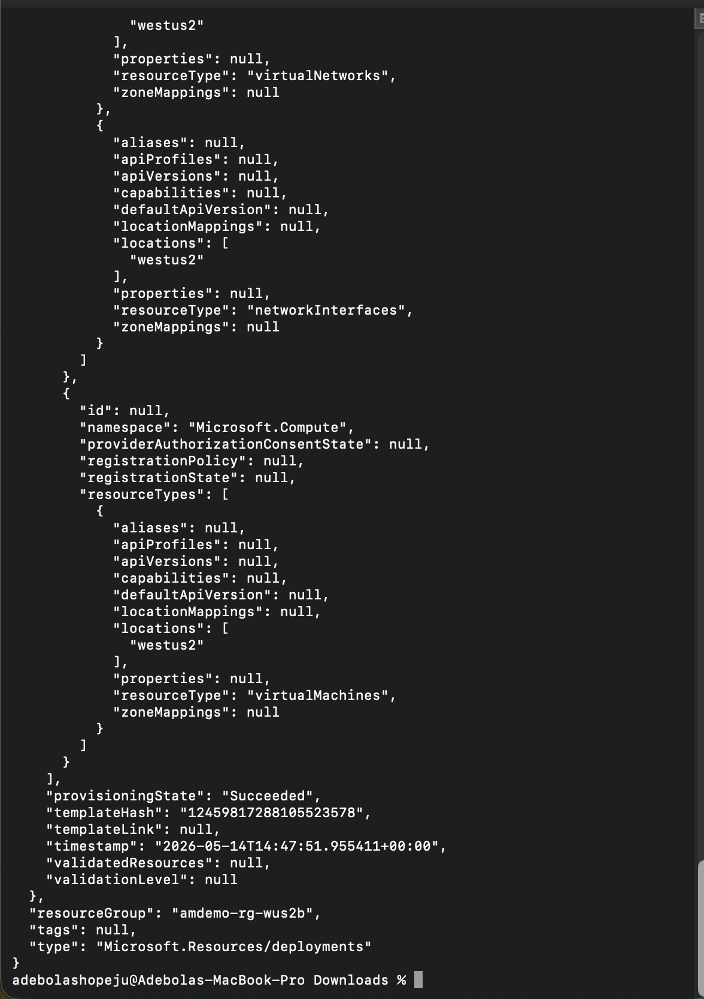
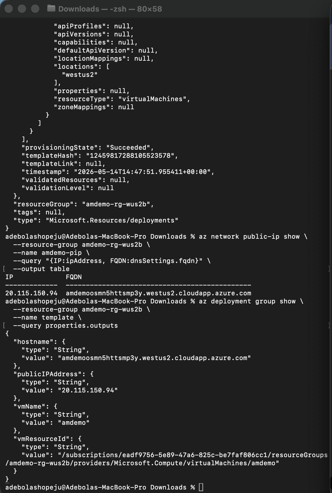
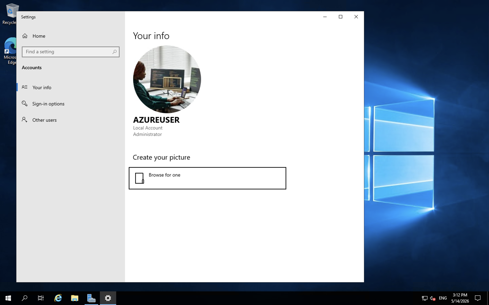

# Adebola Azure ARM VM Deployment

## Project Overview
This project demonstrates Infrastructure as Code (IaC) on Microsoft Azure using ARM (Azure Resource Manager) templates. Instead of manually provisioning resources through the Azure Portal, all infrastructure is defined declaratively in JSON and deployed via the Azure CLI.

## Resources Deployed
- Virtual Machine (Windows Server 2019 Datacenter) — `Standard_D2s_v3`
- Virtual Network (VNet) with a default subnet
- Network Security Group (NSG) with RDP (3389) and HTTP (80) inbound rules
- Network Interface Card (NIC)
- Public IP Address (Standard SKU, Static)

## Deployment Details
| Field | Value |
|---|---|
| Resource Group | amdemo-rg-wus2b |
| Location | West US 2 |
| VM Name | amdemo |
| Admin Username | azureuser |
| Public IP | 20.115.150.94 |
| Hostname (FQDN) | amdemoosmn5httsmp3y.westus2.cloudapp.azure.com |

## Files
| File | Description |
|---|---|
| `template.json` | ARM template defining all infrastructure resources |
| `parameters.json` | Parameter file supplying values to the template |

## Azure CLI Commands Used

**Create Resource Group:**
```bash
az group create --name amdemo-rg-wus2b --location westus2
```

**Deploy ARM Template:**
```bash
az deployment group create \
  --resource-group amdemo-rg-wus2b \
  --template-file template.json \
  --parameters @parameters.json \
  --parameters adminPassword='<your-password>'
```

**Verify Public IP and FQDN:**
```bash
az network public-ip show \
  --resource-group amdemo-rg-wus2b \
  --name amdemo-pip \
  --query "{IP:ipAddress, FQDN:dnsSettings.fqdn}" \
  --output table
```

**View Deployment Outputs:**
```bash
az deployment group show \
  --resource-group amdemo-rg-wus2b \
  --name template \
  --query properties.outputs
```

## Verification Screenshots





